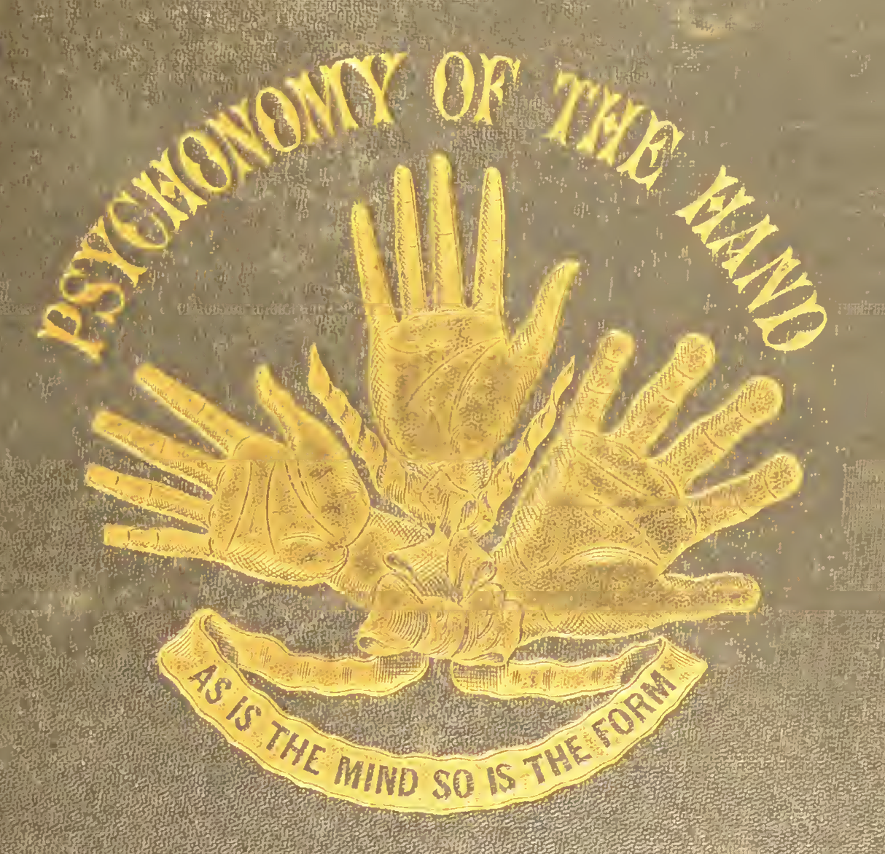

> And thus, having convinced himself that the hand of a poet did not resemble that of a mathematician, nor the hand of a man of action that of a man of contemplation, he pro-ceeded with his investigation through every grade of life. All forms of hands had for him now a signification; though to determine the relation which subsisted between some of them, and the special mental organization of which they were the index, required years of study and observation.

I'm waiting to start doing my hand illustrations until a replacement tablet stylus arrives because I'd like clean vectors to work with. While I wait, I'm reading the first of the palmistry books I listed in my first journal, and it's aready perfect. Impossible to parody this stuff. There's a quality to this specific kind of highly puffed-up 19th century quackery that I adore, even though it belies what I consider to be a fairly grotesque worldview.

I am going to wait until mid week to do any more slider experiments. I plan to try to test both the separate slider and the integrated slider methods if it's not too much work. I definitely believe I can get the whole idea done within four weeks as something to evaluate because only a very convoluted version of the integrated slider would be novel enough to stand on its own and I don't think it would feel good to use. I do think that a simple slope integrated slider like the lines on a hand is still a possibility, but that means either way the whole-hand prototype is likely the minimum viable (forgive me for using this businessy term) version. It's possible that the story generation part could come later, but I already have pretty good experience with text generation via Markovify and Tracery, so I'm guessing that a working version will come very quickly and tweaking it to sound the way I like will be a long process.
